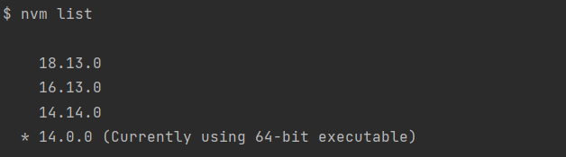

# Clock Blog Front

<h1>1.Introduction</h1>

`Clock Blog Front` is a blog ui base on Vue.  

<h1>2.Dependency</h1>

**Envs**
  *  NodeJs-14

<h1>3.How to get start</h1>

1. **If u had a NodeJs-14 env already, skip this.** 
     * Install nvm to manage your nodejs envs: `https://github.com/coreybutler/nvm-windows/releases`
     * `nvm install 14.0.0`
     * `nvm use 14.0.0`
     * `nvm list` to see what env are you use now
     * 

2. `npm install`

3. `npm run dev`

