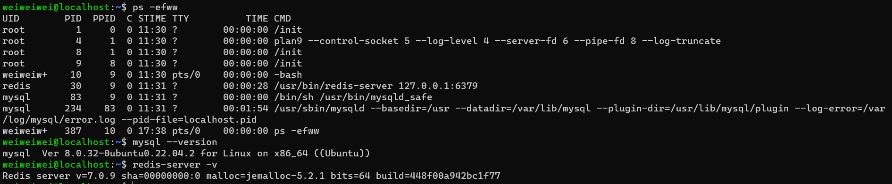
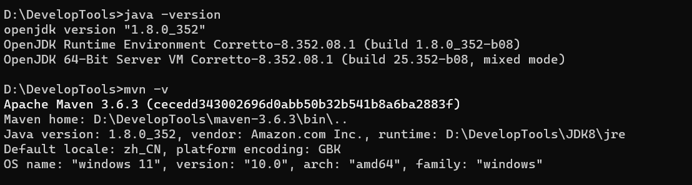

# Clock Blog
<h1>1.Introduction</h1>

`Clock Blog` is a blog system base on SpringBoot and Vue.  
Blog-User-UI:  https://github.com/0utsiderZhong/BlogFront 
Blog-Admin-UI: https://github.com/0utsiderZhong/BlogBackend 

<h1>2.Dependency</h1>

**Envs**
 - Java8
 - Maven3.6
 - Mysql
 - Redis

<h1>3.How to get start</h1>

1. Install `Mysql` and `Redis` in your os, I use `wsl --install` to install an ubuntu system in my win11, then make services auto start by ubuntu 

   **And others mysql versions and redis versions is fine**
2. Execute *.sql files in your DB, and make sure that execute the DDL at first `clockblog-DDL.sql`

3. Install `Java8` and `Maven-3.6.3`

4. Modify db host:port and redis host:post in `*.yml`
5. Finally, you can start your SpringBoot Application

<h1>4.Todo</h1>

1. **Project is developing...**
2. **Todo List**
    - **Bugs fix**
    - **Support bilingual**
    - **Add ChatGPT API**
    - **Support search with ElasticSearch**
    - **Support Google storage API**

